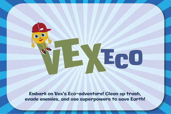

**README.md**

# GameName

Write what is this git respository? GameChallange project for xyz compatation etc.

## Framework and Language
- **Framework**: Flutter Flame
  - [Flutter Flame](https://flame-engine.org/) is a powerful game engine built on top of Flutter, providing a simple yet effective way to create 2D games.
- **Language**: Dart
  - [Dart](https://dart.dev/) is a programming language optimized for building web, mobile, and server applications. It's the language of choice for Flutter development, providing features such as hot reload for fast development cycles and a reactive programming model.

## Requirements
- Flutter SDK
- Android Studio (or any other preferred IDE)
- Emulator or physical device for testing

## Installation
1. Clone or download this repository to your local machine.
2. Open the project in Android Studio.
3. Ensure you have Flutter and Dart plugins installed in Android Studio.
4. Run `flutter pub get` to install dependencies.

## Running the Game
1. Connect your Android device or start an Android emulator.
2. Run the project in Android Studio.
3. The game should automatically launch on your device/emulator.

## Folder Structure
The project follows a standard Flutter app structure with additional directories for game-specific files. Here's a brief overview of the folder structure:

- **assets**: Contains game assets such as images, sounds, and fonts.
- **android**: Contains Android-specific configuration and code.
- **ios**: Contains iOS-specific configuration and code.
- **lib**: Contains Dart code for the game.
  - **components**: Contains reusable game components.
  - **screens**: Contains different screens of the game (e.g., main menu, gameplay screen).
  - **config**: Contains game configs
  - **main.dart**: 
- **test**: Contains unit and widget tests.

## Acknowledgments
- Flutter Flame community for providing a powerful game engine for Flutter.

Happy coding and gaming! 🎮🚀
